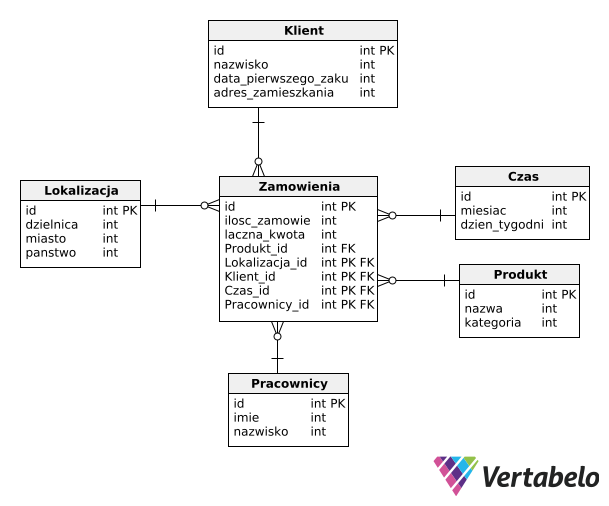

<h3 style="color: #ff2c2d;">Igrzyska Olimpijskie</h3>

:::::::::::::: {.columns}
::: {.column width="33%"}
Bartosz Buczek
s26290
:::
::: {.column width="33%"}
Nazarii Honcharenko
s25249
:::
::: {.column width="33%"}
Irys Latosz
s24435
:::
::::::::::::::

# Źródła danych
- [Olympics-Dataset](https://github.com/KeithGalli/Olympics-Dataset)
- [WorldBank](https://databank.worldbank.org/source/world-development-indicators)

# Pytania badawcze

## General
1. Does total population affect scores?
2. Does income affect scores?

## Gender
3. According to gender equality indicators, do scores change?

## Government/safety

### Homicides;
4. Public Sector/Conflict & Fragility

### Voice and Accountability
5. Public Sector/Policy & Institutions/Voice and Accountabilit
6. Desc: extent to which a country's citizens are able to participate in selecting their government, as well as freedom of expression, freedom of association, and a free media

# Organizacja pracy

## ETL
Realizowany za pomocą Microsoft Visual Studio

## Wizualizacja Danych
Zrealizowana za pomocą MS Excel?

# Diagram (TODO)

# Dziękujemy za uwagę
