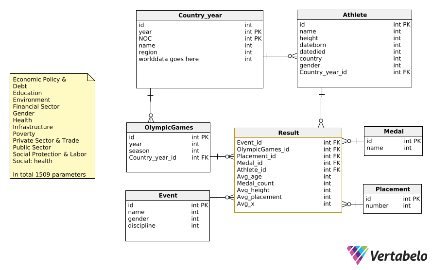

<h3 style="color: #ff2c2d;">Igrzyska Olimpijskie</h3>

:::::::::::::: {.columns}
::: {.column width="33%"}
Bartosz Buczek
s26290
:::
::: {.column width="33%"}
Nazarii Honcharenko
s25249
:::
::: {.column width="33%"}
Irys  (Maciej) Łatosz
s24435
:::
::::::::::::::

# Źródła danych
- [Olympics-Dataset](https://github.com/KeithGalli/Olympics-Dataset)
- [WorldBank](https://databank.worldbank.org/source/world-development-indicators)

## {background-image="olympedia.png"}

## {background-image="olympics-dataset.png"}

## {background-image="worldbank.png"}

# Pytania badawcze

## Zawodnicy

1. Jaki jest średni wiek zawodnika w zależności od dyscypliny sportu?
2. Jak wygląda rozkład wieku zawodników w zależności od dyscypliny sportu?
3. Jaki jest średni wzrost zawodnika w zależności od dyscypliny sportu?
4. Jaka jest liczba medali w zależności od grup wiekowych?
5. Jakie jest średnie miejsce zajmowane przez każdy kraj?

## Kraje

6. Czy populacja jest skorelowana z wynikami?
7. Czy PKB per capita jest skorelowany z wynikami?
8. Czy stabilność polityczna i brak przemocy/terroryzmu są skorelowane z wynikami?
9. Czy cła są skorelowane z wynikami?
10. Czy wydatki na ochronę zdrowia są skorelowane z wynikami? (% z PKB)

# Diagram 

# Dziękujemy za uwagę
